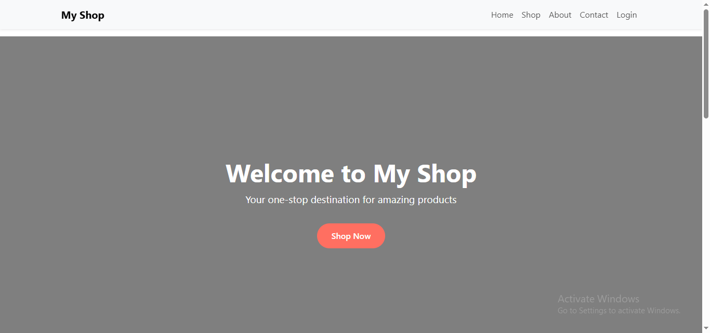
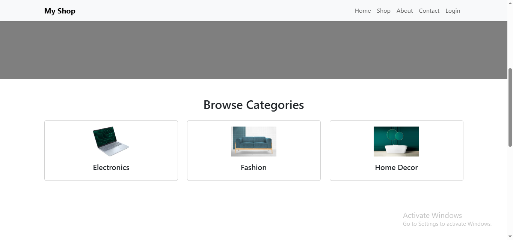
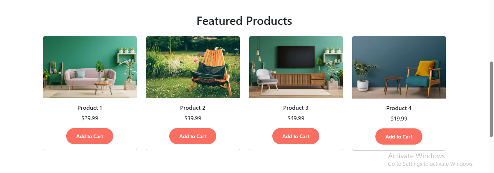
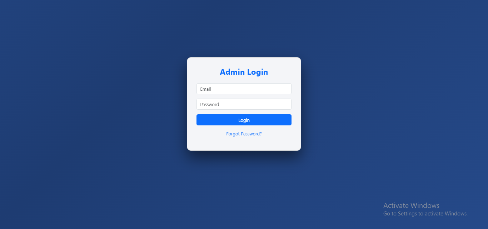
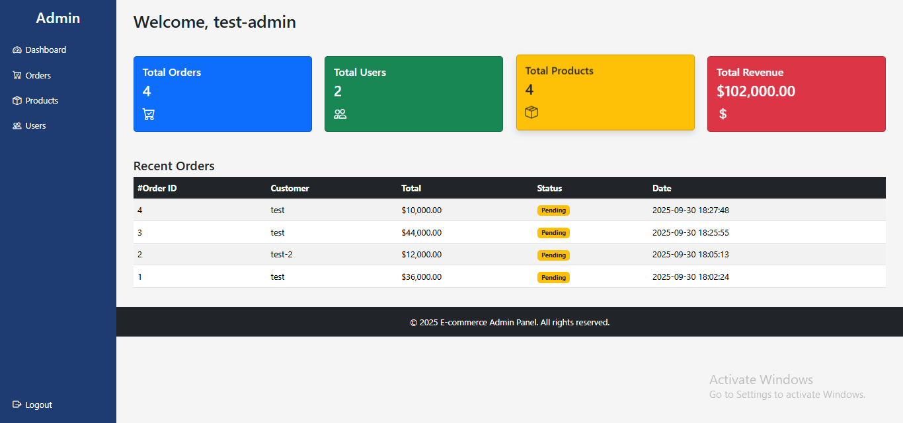
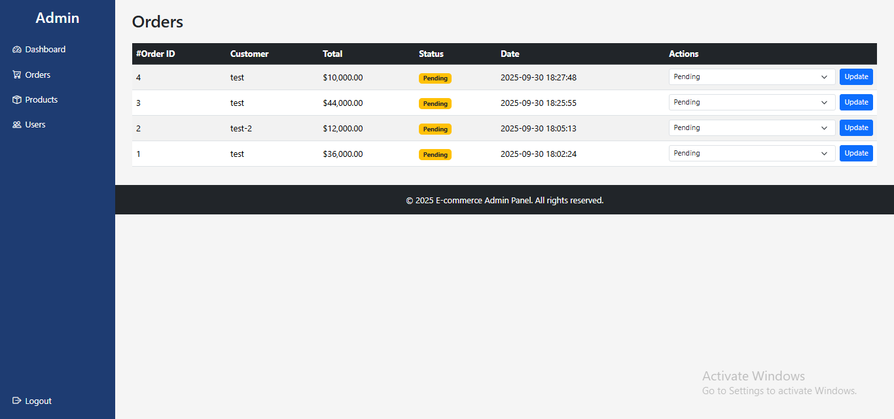

# Ecommerce Website

A complete **E-commerce Website** built with PHP, MySQL, HTML, CSS, and Bootstrap.  
This project includes a frontend for users to browse products, add to cart, and checkout, along with an admin panel to manage products, orders, and users.

---

## Frontend Pages

- **Homepage (`index.php`)** – Displays featured products with images and details  
- **Shop Page (`shop.php`)** – Lists all products with categories and search  
- **Product Detail Page (`product_detail.php`)** – Shows detailed information about a selected product  
- **Cart Page (`cart.php`)** – Add products to cart and update quantities  
- **Checkout Page (`checkout.php`)** – Place orders  
- **About Page (`about.php`)** – About the company  
- **Contact Page (`contact.php`)** – Contact form to send messages  

  
  


---

## Admin Panel

- **Login (`admin/login.php`)** – Admin authentication  
- **Dashboard (`admin/dashboard.php`)** – Admin overview  
- **Manage Products (`admin/products.php`)** – Add, edit, delete products  
- **Manage Orders (`admin/orders.php`)** – View and process orders  
- **Manage Users (`admin/users.php`)** – View and manage registered users  

  
  


---

## File/Folder Overview

| File/Folder                  | Description                                      |
|-------------------------------|-------------------------------------------------|
| `index.php`                  | Frontend homepage                                |
| `shop.php`                   | Product listing page                             |
| `cart.php`                   | Shopping cart page                               |
| `checkout.php`               | Checkout and order placement                     |
| `about.php`                  | About page                                       |
| `contact.php`                | Contact form page                                |
| `includes/`                  | Header, footer, DB connection files             |
| `admin/`                     | Admin panel files (dashboard, login, CRUD)      |
| `assets/images/`             | Product and website images                       |
| `uploads/`                   | Uploaded blog images                             |
| `screenshots/`               | Project screenshots for README display          |
| `db.php`                     | Database connection file                         |

---

## Requirements

- XAMPP (Apache + MySQL)  
- PHP 8.x or above  
- MySQL  

---

## Setup Instructions

1. **Clone or download** this repository to your local machine.  
2. **Copy project folder** to XAMPP's `htdocs` (e.g., `E:\xampp8.2\htdocs\Ecommerce_website`).  
3. **Start Apache & MySQL** from XAMPP Control Panel.  
4. **Create a database** in phpMyAdmin.  
5. **Import the database**:  
   - Open phpMyAdmin → select your database → Import → Choose your `.sql` file (e.g., `ecommerce_db.sql`)  
   - Click Go  
6. **Update database credentials** in `includes/db.php` if necessary:  

```php
$host = "localhost";
$user = "root";
$pass = "";
$db   = "your_database_name";
